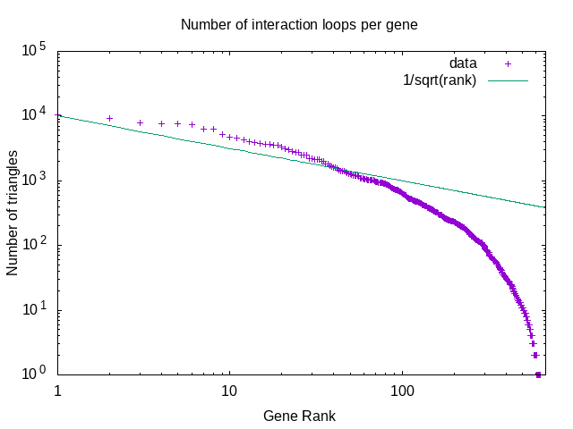
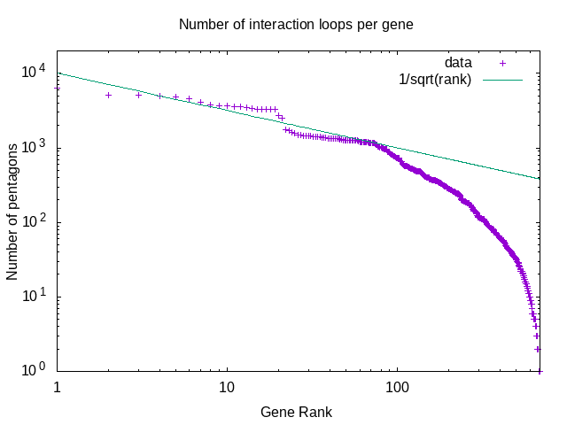
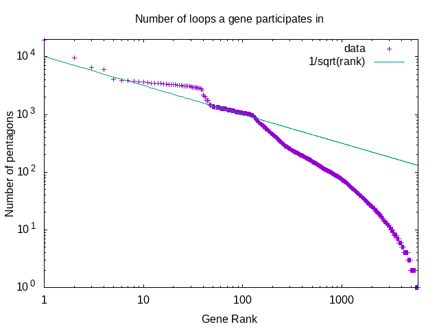
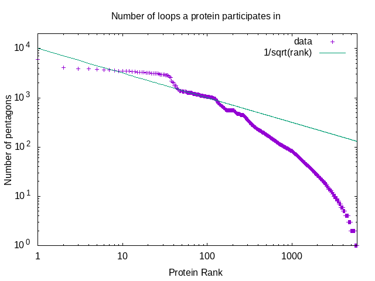

Dataset notes
-------------
I was curious about what's in this dataset, and this directory
contains some notes about what I found.

The benchmark looks for triangles of the form
```
	(Evaluation (Predicate "interacts") (List gene (Variable "$a")))
	(Evaluation (Predicate "interacts") (List (Variable "$a") (Variable "$b"))
	(Evaluation (Predicate "interacts") (List gene (Variable "$b")))
```
where `gene` is a given gene, specified by the scientist, and `$a` and
`$b` are two other genes that interact with it.  Given the above
contraints, these interaction make a loop or triangle.

There are then two questions:
* For a given gene, how many triangles are there?
* For a given `$a`, `$b`, how many triangles did it participate in?

These questions are answered below.

=== gene-loops.csv ===
The number of triangle shaped interactions for each given gene.
When plotted on a log-log graph, the distribution is clearly not
Zipfian, except maybe at the very beginning. The eyeballed fit
is 1/sqrt(rank).



=== loop-participants.csv ===
A count of the number of times that a gene appered in a triangle.
Perhaps its Zipfian initially, but certainly not at the tail end.
As before, the eyeballed fit is 1/sqrt(rank).


=== path-*.csv ===
As above, but now for the pentagon shapes. So `path-loops.png`
shows how many pentagons each of the 681 genes participated in.
The `path-proteins.png` shows how many distinct proteins show up
in the loops, and how many loops each of the proteins participate
in. The `path-genes.png` is the same, but for the genes showing
up in the loops.

These are called "paths" because each pathway is tagged with a distinct
pathway tag from the NCBI dataset.

As before, the eyeballed fit is 1/sqrt(rank). This time, there is
a region where this fit is almost exact.





== Remarks ==
The reason for the intial 1/sqrt(rank) is mysterious. Why this
isn't true Zipfian is also unknown to me.  I was expecting something
scale-free, and its not.

* Is it because the list of 681 genes to look at was hand-picked,
  and not a random sampling?
* Is this just due to bad (incomplete) genetic interaction data,
  or is nature actually like this?
